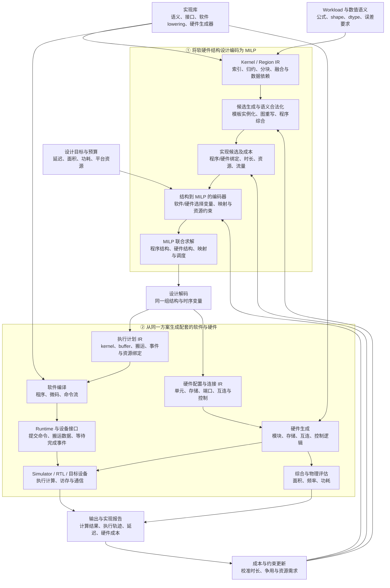
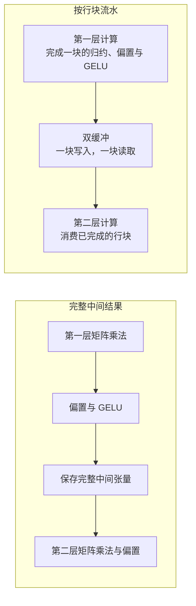

# Break Layer · Project Brief

> 将硬件结构设计与配套软件结构设计共同转化为 MILP：把结构选择编码为变量，把语义、连接、资源与时序关系编码为约束，求解后从同一组变量生成软件程序和硬件结构。

**更新日期：2026-10-07 · Brief 版本：v0.52**

本文面向具有技术背景、尚未参与项目的读者。正文按 12 页研究汇报组织：研究问题 → 核心方法 → 系统架构 → 关键技术 → 实例 → 研究假设与实验 → 当前基础 → 技术研究路线。每节的核心句和图表用于主讲，展开说明可放入演讲者备注。

**阅读口径：** 第 01–10 页介绍研究主张与目标系统，第 11 页标明已有实验基础，第 12 页展开后续技术问题。当前有限模板原型用于检验方法；目标架构中的程序综合、软硬件生成和物理反馈尚待研究与实现。

---

## 01｜研究目标：将硬件与配套软件的结构设计转化为联合求解

**核心研究问题：如何把“硬件由什么组成、软件怎样组织并使用它”编码进同一个 MILP，让结构随目标与预算共同确定？**

输入包括 workload 的数学计算、张量形状和精度要求，可使用的计算与存储元件，以及延迟、面积、功耗等目标或预算。

目标系统输入同一个计算任务，搜索并输出三类相互关联的设计：

- **计算与程序结构：** 分解、融合、流水、指令组合，以及数据搬运和同步方式。
- **硬件结构：** 通用与专用单元的分工、资源共享、存储组织、互连和控制方式。
- **系统折中：** 在不同延迟、面积与能耗要求下，哪些结构更合适，以及瓶颈为何发生变化。

Break Layer 的核心是**让层间边界成为设计变量**：哪些操作合成一个 kernel，哪些计算运行在通用单元上，哪些值得交给专用数据通路，以及这些选择如何改变整个系统。

方法上的主张是：**将有限范围内的软硬件结构设计编译成一个可求解的组合优化问题。** 软件的融合、指令与流水选择决定资源需求；硬件的模块、配置与连接选择决定资源供给；MILP 同时决定两侧及其映射，解码得到配套的程序与硬件。真实实现再反馈成本和结构限制。

依据：[总体设计 §1、§3–4](workload_to_system_codesign_v2_cn.md)、[路线图 F](roadmap_cn.md)。

---

## 02｜关键问题：计算图、硬件结构和执行顺序相互决定

**一旦提前固定其中一层，就会限制其他层能够找到的解。**

以 Transformer 的前馈网络（FFN）为例：矩阵乘法、加偏置、激活和第二次矩阵乘法，可以独立执行、局部融合，也可以组成分块流水。三种组织方式会改变中间数据的大小、读写次数、可重叠区间和专用硬件需求。

| 可以改变的边界 | 连带改变的系统决策 |
|---|---|
| 算子 → kernel：拆分、融合、归约顺序 | 启动次数、数据复用、并行度、数值行为 |
| kernel → 实现：向量程序、微码、专用流水 | 指令与控制开销、硬件面积、可编程性 |
| 数据 → 存储：完整保留、分块传递、后续扩展的重计算 | 容量、带宽、搬运量和消费者启动时间 |
| 任务 → 资源：复用同一单元或增加并行单元 | 调度重叠、资源争用、功耗与面积 |

因此，研究问题是：**能否从数学语义生成多种合法结构，并在同一个全局模型中联合选择计算边界、实现方式、资源数量和调度？**

依据：[总体设计 §3](workload_to_system_codesign_v2_cn.md)、[推导 §5、§9–11](workload_to_milp_derivation_cn.md)。

---

## 03｜核心方法：结构离散化 → 变量与约束 → MILP → 软硬件解码

**关键转换是把程序结构与硬件结构表示为可选择、可组合的有限设计元素，再把两者的相互要求写成线性约束。**

1. **离散化结构。** 将软件的分块、融合、指令序列、流水模板，与硬件的模块类型、参数档位、共享方式和允许连接表示为有限选项。复杂的局部结构可由模板或语义综合产生。
2. **建立变量。** 用 0/1 变量表示采用哪种程序结构、启用哪个模块、选择哪条连接或映射；用整数变量表示资源数量和离散时间。一个变量的取值会改变最终生成的程序或电路。
3. **联立约束。** 软件必须实现完整计算；所用操作必须有匹配的硬件；数据必须经合法连接到达；并发需求不能超过计算、端口、带宽与存储供给；总成本满足预算。
4. **求解并解码。** MILP 求得一组相互兼容的结构与时序选择。将同一组选择分别展开为执行计划和硬件配置，再生成程序与硬件。

**为什么能用 MILP？** 结构选择是离散的；固定某个参数化实现后，其局部时长、面积和资源曲线可以预计算为系数；“选择 A 就需要 B”“二者不可同时采用”等逻辑可写成线性约束。由此将复杂实现细节封装为有限结构选项，把跨结构的组合关系留给全局求解。

这一方法的研究难点是选择合适的编码粒度：整体候选易于估价，模块级变量能表达更多共享与连接方式；更细的表达也会扩大求解规模。最优性范围由所编码的结构空间、成本和约束共同限定。

依据：[总体设计 §4–5](workload_to_system_codesign_v2_cn.md)、[路线图 B、D–F](roadmap_cn.md)。

---

## 04｜系统架构：一份联合设计，生成软件与硬件两条实现路径

**结构到 MILP 的编码器把设计空间变成优化模型；解码器把求解结果同时还原为软件执行结构与硬件空间结构。**

以下为目标闭环架构；当前覆盖范围集中见第 11 页。IR（中间表示）是各阶段之间传递计算、资源和执行决策的结构化描述。

**图中的三个连接点：**

- **实现库贯穿前后端：** 候选选择的软件 lowering（降到目标指令或命令的规则）和硬件生成器，在实现阶段继续使用。
- **同一解生成两个 IR：** 程序采用什么结构、映射到什么模块，与硬件启用哪些模块和连接，在 MILP 中已经相互约束；解码时保留这种对应关系。
- **执行与综合分别反馈：** 执行暴露时序、流量和争用，综合提供面积、时钟等实现数据；它们共同更新候选成本与适用条件。

依据：[总体设计 §4](workload_to_system_codesign_v2_cn.md)、[路线图 C–F](roadmap_cn.md)。

---

## 05｜语义到候选：把实现空间从固定算子边界中展开

**Kernel / Region IR 要表达计算的索引、归约和数据依赖，使系统能够改变执行边界。**

以矩阵乘法为例：

\[
C[I,J]\mathrel{+}=A[I,K]B[K,J].
\]

\(I,J\) 决定输出块，\(K\) 决定归约分块。改变 tile 大小、输出块分工或后续操作的融合方式，就能产生不同的程序与硬件需求。

候选生成分三步：

1. **结构展开：** 枚举分块、融合和分块流水；逐步加入布局变换、指令组合以及有界的算术/存储/控制结构综合。
2. **语义合法化：** 检查索引覆盖、完整归约、浮点规则和外部输出。例如 GELU 必须等对应输出的完整归约结束；融合残差与归一化时，仍需保留其他消费者使用的残差。
3. **实现绑定：** 匹配实现库中的指令能力、接口与硬件参数，形成可以估价、可以降低为程序或硬件的候选。

当前使用参数化模板；后续以小型表达式和已有 primitive 为起点引入程序综合与 SMT 语义检查。实数等价、浮点逐位等价和容差内等价需要分别定义。AI 提案也可接入同一候选入口。

依据：[实践规范 §5](workload_to_system_codesign_practice_cn.md)、[路线图 A–B](roadmap_cn.md)。

---

## 06｜实现库与成本：把“怎么实现”连接到“代价多少”

**一个实现条目需要同时携带语义能力、生成方法、接口限制和性能模型。**

| 实现条目的内容 | 作用 |
|---|---|
| 语义与适用域：计算、dtype、shape、归约与布局限制 | 判断能否承接某个 region |
| 软件实现：指令模板、循环、微码或命令 lowering | 把选中候选编译成实际程序 |
| 硬件实现：参数化模块、RTL/IP、存储与端口协议 | 生成计算资源和数据通路 |
| 成本与资源曲线：时长、并发需求、buffer、流量 | 支持全局调度和资源配置 |
| 平台数据：器件/工艺、频率、面积、功耗、测量条件 | 将解析估计逐步校准到真实实现 |

局部成本同时考虑计算服务、存储服务与启动开销。充分重叠时可用
\(\max(T_{\mathrm{compute}},T_{\mathrm{memory}})+T_{\mathrm{launch}}\)
估计阶段时长；串行服务时用求和。能采用哪种模型，取决于实现的流水、端口和控制能力。

元件级成本还需要扩展到组合级成本：多个单元共享 SRAM、链路或队列时，会产生争用；布局布线也可能降低频率。采集路线是**单元 → region → 子系统**，优先校准会改变候选排序的因素。ASIC 与 FPGA 保留各自的面积或 LUT/DSP/存储资源口径。

依据：[实践规范 §6](workload_to_system_codesign_practice_cn.md)、[路线图 C–D](roadmap_cn.md)。

---

## 07｜如何编码：把软件需求、硬件供给和连接关系放进同一个 MILP

**模型的两侧都可变：选择程序结构，同时决定能够执行它的硬件结构。**

| 设计决策 | MILP 中的表示 | 连接软硬件的关键约束 |
|---|---|---|
| 软件怎样分解、融合与流水 | \(q_{rc}\)：区域 \(r\) 是否采用实现 \(c\) | 覆盖完整语义，保留正确的数据来源和外部输出 |
| 硬件有哪些单元、采用哪些参数 | \(n_h\)：资源数量；\(y_{ip}\)：实例 \(i\) 是否采用配置 \(p\) | 配置互斥、面积/功耗预算，以及对应的能力与容量 |
| 程序操作在哪个实例运行 | \(b_{rci}\)：候选或阶段与实例的绑定 | 仅选中的计算能绑定；实例必须存在且支持对应操作 |
| 数据如何经过存储和连接 | \(z_{ij}\)：连接是否启用；位置/路由选择变量 | 端点存在、接口匹配、数据流连续、端口与链路容量足够 |
| 操作何时执行、数据保留多久 | \(x_{rct}\)：选择实现并在 \(t\) 启动；驻留变量 | 数据就绪、资源不超用、buffer 生命周期与容量合法 |

其中 \(q_{rc}=\sum_t x_{rct}\)。当前原型采用候选选择、资源数量和启动/驻留变量；实例配置、绑定与连接变量是向更细结构扩展的编码思路，尚未加入当前模型。

软件需求与硬件供给最直接的耦合是：

\[
\sum_{r,c,t}U_{rch}(\tau-t)x_{rct}\le n_h,\qquad \forall h,\tau.
\]

左侧是所选软件候选在时刻 \(\tau\) 的资源需求，\(U_{rch}\) 是预计算的相对占用曲线；右侧是待求的硬件数量。选不同流水会改变左侧，增加硬件会放宽右侧并消耗面积预算。因此求解器能够权衡“改程序、错开执行、增加硬件”三种选择。

**保持线性的关键：** 将 lane 数、tile、局部流水等参数取成有限档位，预计算各档位的时长和资源需求；用选择变量激活系数。条件依赖与选择乘积采用有界线性编码，避免直接把“工作量 ÷ 待求单元数”写入模型。硬件面积按实例或配置计费，同一单元被多个程序片段复用时只计一次面积，并通过逐时刻容量限制复用。

当前以最小化最终写回时间为目标，延迟最优后再最小化面积。结构约束的编码示例见附录 D。

依据：[推导 §6–12](workload_to_milp_derivation_cn.md)、[路线图 E](roadmap_cn.md)。

---

## 08｜软硬件边界：同一段语义可以对应不同的计算结构

**将可编程性、资源共享和空间并行之间的取舍纳入搜索。**

以一段逐元素表达式为例，候选可以覆盖以下实现方式；这些方式允许组合，其边界由控制和资源组织定义。

| 实现方式 | 主要设计自由度 | 必须计入的代价 |
|---|---|---|
| 标量或 SIMD/向量程序 | 指令选择、lane 数、向量宽度、循环与数据布局 | 指令发射、地址生成、尾块、寄存器与 shuffle |
| 微码控制的共享数据通路 | 算术单元复用、操作次序、寄存器与控制状态 | 时间复用带来的周期、mux、控制与中间存储 |
| 专用空间流水 | 算术模块连接、流水级、并行度与局部缓冲 | 面积、布线、流水填充、带宽与背压 |

搜索粒度可以从已有实现菜单，逐步下沉到算术单元、寄存器、mux、FIFO 和存储端口的有限组合。核心问题是：**何时应以时间复用节省面积，何时应以空间展开换取吞吐，以及局部专用化能否转化为全局收益。**

在 MILP 中，这些路径表现为互斥的软件/硬件实现选项，以及可共享的模块和连接变量。选择向量程序会激活向量单元的能力与调度约束；选择专用流水会激活相应数据通路、缓冲和带宽需求。执行计划 IR 与硬件配置 IR 再从同一组解分别恢复操作时序和空间组织。

另一个研究问题是**静态计划在可变时延下如何保持可执行性**：完成事件、资源和 buffer 复用依赖决定安全的启动条件；端口冲突、队列与背压决定真实时长。这些因素既影响执行协议，也可能改变最优结构。

依据：[路线图 B：细粒度结构搜索、F：映射与执行协议](roadmap_cn.md)。

---

## 09｜贯穿实例：FFN 的一个实现选择如何改变整套系统

**同一个公式，可以对应完整中间张量、融合 kernel，或两级计算单元之间的分块流水。**

\[
Y=\mathrm{GELU}(XW_1+b_1)W_2+b_2.
\]

| 选择 | 软件组织 | 硬件与存储影响 |
|---|---|---|
| 独立算子 | 多次启动，逐步保存中间结果 | 通用资源可分时复用；中间读写较多 |
| 局部融合 | 将矩阵计算与偏置/激活组合 | 可使用专用 epilogue 单元；仍可能保留完整层间结果 |
| FFN 分块流水 | 按行块交错启动上下游，等待 buffer 完成事件 | 上下游并发需要相应资源；层间数据可限于行缓冲 |

**把这项结构选择写成 MILP：** 在一个仅含“共享矩阵单元串行执行”和“两个矩阵单元分块流水”的说明性设计空间中，用 \(q_s,q_p\) 表示两种软件结构：

\[
q_s+q_p=1,\qquad n_{\mathrm{Matrix}}\ge q_s+2q_p,\qquad q_s,q_p\in\{0,1\}.
\]

选 \(q_p=1\) 会同时要求至少两个 Matrix、激活流水阶段的并发占用和双缓冲需求，并在解码时生成配套的行块程序与硬件配置。是否值得为流水增加硬件，由延迟目标、面积预算以及带宽/存储约束共同决定。这两条式子展示选择与硬件供给的关联，完整调度还需第 07 页的逐时刻约束。

**容量示例：** 假设 \(S=128\)、FFN 宽度 \(F=512\)、FP32、行块大小 16。单份完整层间张量占 \(128\times512\times4=256\) KiB；两块行缓冲占 \(2\times16\times512\times4=64\) KiB。这里只比较层间数据，不含权重、输出或计算单元本地存储，也不代表实测加速。

优化器需要进一步权衡：节约的容量是否值得额外并发资源，权重带宽能否支持重叠，以及共享硬件时是否反而应该采用串行计划。默认 \(S=32\)、tile=32 时只有一个行块，流水模板也没有跨行块重叠空间。

依据：[实践规范 §5.3、§6](workload_to_system_codesign_practice_cn.md)、[推导 §5](workload_to_milp_derivation_cn.md)。容量数字为本页说明性计算，非默认实例实验结果。

---

## 10｜研究贡献与验证：哪些设计自由度真正有价值？

**拟形成的核心贡献，是一套把配套软件与硬件结构转化为统一 MILP 的表示与编码方法，使结构、映射和调度可以联合求解，并从同一解恢复两侧实现。**

| 研究假设 / 贡献方向 | 对照实验 | 主要观测量 |
|---|---|---|
| **统一编码能表达并求解结构之间的耦合** | 小型结构空间与穷举对照；固定候选空间比较整体候选与更细模块/连接编码 | 可表达的设计集合、目标值、变量/约束规模、求解耗时与 gap |
| **语义生成能发现有价值的新结构** | 固定模板，与增加重写/综合候选的空间比较 | 新结构是否被全局选中、目标改善、候选生成与语义检查开销 |
| **计算边界与资源供给联合决策优于分步固定** | 固定硬件优化软件、固定计算结构优化硬件、分步优化与联合优化 | 面积—延迟折中、流量、资源利用，以及各解的 bound/gap |
| **软硬件分工应随任务与预算改变** | 通用程序、微码共享数据通路、专用流水及其混合实现 | 分工发生变化的条件、实现后的面积/性能、跨 shape 适应性 |
| **实现反馈会改变设计排序** | 解析模型选出的方案，与经校准模型选出的方案比较 | 保留样本上的预测误差、排序变化、实现收益与总搜索成本 |

对照需固定数值契约、设计预算和评价条件，并报告搜索预算与求解差距。跨 workload 的实验固定一套硬件，观察程序适配与性能变化，避免把每个输入重新设计硬件的收益混入泛化结论。

项目已有基础是有限模板、联合 MILP 和分块执行；上述贡献与收益仍需实验建立。

依据：[总体设计 §3–4](workload_to_system_codesign_v2_cn.md)、[路线图 B、D–G](roadmap_cn.md)。

---

## 11｜已有研究基础：有限模板上的联合搜索与初步观察

**当前系统能为一个 Transformer block 生成分块/融合候选，并联合求解硬件数量与静态调度。**

默认 workload 为 FP32 单次 prefill：batch=1、序列长 32、隐藏维度 128、4 个注意力头、FFN 宽度 512。硬件采用矩阵、向量、特殊函数与融合单元，固定 HBM ↔ SRAM ↔ 计算资源拓扑。

- **已具备的研究变量：** 14 个语义节点上的 region 覆盖、tile/融合选择、硬件数量与静态调度；模型同时表达资源并发和存储生命周期。
- **可观测结果：** 计算结构、硬件数量、阶段调度、存储峰值与流量、解析性能预测，并可执行所选分块计算。
- **尚未覆盖的自由度：** 通用语义综合、细粒度硬件结构、bank/互连映射搜索和动态功耗；已有固定地址/单端口的命令模拟器，RTL 与物理成本校准尚未接入。

2026-09-23 的短时实验反映了两个技术问题：

| 观察 | 对下一步的意义 |
|---|---|
| 独立算子空间得到 114 µs 的模型内最优解；允许局部融合/流水时已有 104 µs 可行解，但 gap 仍约 46%–48% | 更大的结构空间需要更强的下界与收敛策略 |
| 同一解析框架下，计算/存储充分重叠与串行服务的可行值分别为 104 和 156 µs | 重叠能力与存储实现值得优先校准 |

上述时间均为 toy-analytical-v1 模型值；融合组仍沿用初始调度，差值不能归因于 MILP 独立收益。详细条件见附录 A。调度与数值检查已通过；受控收益实验和真实硬件闭环尚待完成。

新增命令后端已经将所选设计落实为汇编、具体地址和共享端口执行，并完成一次模型成本反馈。串行 region 限制使优化可简化为 52 个候选、53 个变量；region 内保留多 Matrix 并行。预算 16/20 下，完整 Transformer 分别使用 1/2 个 Matrix，得到 192,864/130,936 个模拟周期，两套输出和停顿检查通过。这说明受限结构选择已经能够对应到可执行程序；周期、面积和时钟仍为 toy 服务假设，后续用局部 RTL/综合校准，不能与前述解析时间直接比较。

同日新增的[研究难度标定](experiments/course_difficulty_20260923_cn.md)进一步表明：默认完整有限空间约35秒可证明102 µs的延迟最优；扩大到S128、4档tile与3档engine group后，36,091变量的直接求解600秒仍为344 µs。领域预取调度族得到304 µs，原空间独立下界为260 µs，认证gap14.47%。这支持以存储驻留与并行资源的耦合作为复杂研究切入点；同生成器随机窗口也找到304 µs，经验记忆的额外价值尚未建立。实验仍以latency为目标，尚不能外推到自由汇编或能效评分。

最新的[固定输入联合空间实验](experiments/course_fixed_space_20260923_cn.md)保持同一Transformer，仅开放8维硬件与每GEMM独立M/N/K、数据流和缓存选择。4项及3456项基点可穷举证明；约10²⁵个标签的完整空间虽然使普通启发式表现分化，仍被结构界与独立候选在数秒内证明全局最优。这一否定结果揭示：有效难度取决于无法消去的存储/调度耦合，单纯增加菜单数量不能保证领域agent的长期搜索价值。当前有限程序族及toy活动能耗不等于自由汇编和物理PPA。

继续开放head/行分块、真实权重重载及逐源预取后，同一输入的可行软件结构改变了小SRAM硬件的可行域。领域方案达到全局最优的至少97.74%；所有方法共同继承旧最优后，180秒的领域分数比通用局部方法高5.20%，5个配对seed同向，完整上界仍未闭合。该族可作联合搜索试行榜单；经验记忆的额外收益尚未证实，当前方案也可能已经是真最优，不能把未闭合的2.26%认证gap当成真实剩余收益。进一步核对发现11664种硬件仅4种仍有机会刷新纪录，硬件主导主榜需要新的MAC、RF、SRAM与带宽面积/能耗耦合和固定软件映射协议；[下一版草案](experiments/hardware_focused_benchmark_design_20260923_cn.md)尚未实施或标定。

对旧模型的固定程序扫描提供了额外反证：收紧延迟会把最佳硬件从单cluster推向多cluster，多个门槛下最佳方案仍全部使用1MiB共享SRAM。新研究聚焦[一个硬件主导候选题目](experiments/hardware_focused_benchmark_design_20260923_cn.md)：同一预算下MAC、RF、本地/共享SRAM与端口资源交换；agent提出硬件结构和可反驳的经验，MILP求解可信tiling/驻留/绑定/调度，独立执行器验证分数。旧11664硬件中2916/61/1003分别被必要容量/面积/延迟条件排除，7680个仍可能运行但乐观分数界已落后，只剩4个有机会超过当前解。新题目以强界后的有效硬件数和20秒至72小时收敛曲线验收；其1727亿原始标签未证明长期困难。

另有[可编程多层 Transformer 挑战](programmable_transformer_codesign_challenge_cn.md)作为更开放的研究候选。同一四层模型的 M1/P1 prefill 加首步与 M1/D1 连续 decode 共同检验程序和硬件结构的耦合。两份基础指令汇编已完整运行；当前修正的 `pipeline-global-events-v2` 明确跨工作组 HBM 依赖和全局步骤提交，并冻结[release_v06_r3 基线](../examples/challenge/release_v06_r3/baseline_manifest.json)，P1/D1 周期仍为 79,210,901/41,235,284。新受信隐藏报告已签发 v2 模型分数 1000.0，本轮功能、评分和资源验收已完成；完整报告只读复算按用户要求提前停止；[旧 v1 报告](experiments/challenge_two_case_release_evidence_20260924_cn.md)中的公开/私有数值、签名和 1000.0 分仅作为历史模型证据。模型面积与能耗未做物理校准，课程搜索难度也须另行审计。

依据：[实践规范](workload_to_system_codesign_practice_cn.md)、[成本实验报告](experiments/cost_audit_20260923_cn.md)、[可执行 MVP 方案](executable_mvp_plan_cn.md)、[命令实验记录](experiments/command_mvp_20260923_cn.md)、[固定输入报告](experiments/course_fixed_space_20260923_cn.md)。

---

## 12｜技术研究路线：逐步扩大可联合设计的结构与约束

**主轴是逐步扩大可以编码进 MILP 的软硬件设计自由度，并研究表达能力、模型精度与求解规模之间的取舍。**

| 研究方向 | 关键设计点 | 要解决的技术问题 |
|---|---|---|
| **① 语义与结构综合** | 图重写、指令组合、分解/融合/流水、浮点误差契约；有界综合与 SMT | 如何系统地产生超出手写模板的候选，并保证局部变换可组合成合法全图？ |
| **② 软硬件边界与结构粒度** | 将程序、模块配置、资源共享和连接编码为变量；覆盖标量/SIMD、微码与专用流水 | 哪些结构适合整体枚举，哪些应拆成模块级变量？如何同时表达指令程序和数据通路？ |
| **③ 存储—通信—计算协同** | 独立 tile 轴、layout、placement、bank/端口、路由、spill/reload、重计算 | 如何把位置、流量、连接与生命周期转成耦合约束，使程序与存储互连一起设计？ |
| **④ 可扩展全局优化与 Pareto** | 分层求解、按需候选生成、有效下界、安全剪枝；预算约束与前沿搜索 | 如何在增强 MILP 表达能力时控制模型规模，并保留有效下界和结构间的关键耦合？ |
| **⑤ 物理成本与多层反馈** | ASIC/FPGA 元件参数；单元到子系统的成本；综合、布局布线与测量 | 资源共享、争用和频率下降如何改变设计排序？如何用有限测量提高搜索决策质量？ |
| **⑥ 功耗、热与动态执行** | 已配置/活跃资源分离、暗硅、power gating、DVFS、热历史、停顿与背压 | 有多少资源能同时工作？功率、温度与可变时延约束如何改变结构和运行计划？ |
| **⑦ 多 workload 与可编程性** | 固定硬件上的多 shape/任务、吞吐、能耗、竞争与尾延迟 | 专用化收益与适应范围如何权衡？单任务最优结构是否适合真实工作负载集合？ |

这些方向的依赖关系是：**语义与元件契约决定候选空间，存储通信与动态行为决定可行域，全局优化寻找设计折中，物理反馈修正前述假设。** 多 workload 评价检验这些选择的适用范围。

可编程挑战的另一项研究方向是[存储层次与资源平衡](drafts/transformer_codesign_vnext_cn.md)：将 RF 容量与驻留、SH bank冲突与广播、有限访存合并与请求前端、HBM延迟与在途请求、可选SH直供矩阵操作数及面积/功率预算一起建模，并区分主赛与大模型压力档，研究架构选择是否对成本扰动稳健、精确评估能否保持可承受开销。该方案为设计草案，v0.2已有独立审查，v0.3新增竞争规则与v0.4静态配平参数仍待实现验证，尚未实现、实测或替代现行题目。

[成本配平分析](drafts/vnext_balance_principles_20260930_cn.md)将部件相对价格与整机预算分开，通过限定菜单、供数上界、带宽延迟积和同路径能量账检验假设；本轮仅形成可复算的静态诊断，尚未构成完整程序性能或动态功率结论。

研究切入点从现有 MatMul/逐元素/FFN 语义展开：先比较有限模板与小范围自动综合，研究哪些新增结构能改变全局选择；再引入具体存储映射和元件数据，观察折中曲线如何变化；最后扩展到动态功耗与多任务条件。推进依据是问题之间的依赖和实验发现。

一条具体实现路线是利用 [Gemmini 的参数化 NPU 系统](experiments/gemmini_codesign_experiment_design_20260925_cn.md)：固定 GEMM 功能与硬件预算，将阵列、片上存储、搬运规则和程序映射一起选择，在同一 RTL 测量口径下与开源项目的默认及预算内最强软硬件配置对照。先检验解到程序/硬件的一致性与有限空间搜索，再判断能否取得可解释的周期收益；面积与能耗结论等待同口径物理数据。

[CCI 单案例](experiments/gemmini_cci_g0_g1_20260927_cn.md)已在相同 256 PE、存储与 DMA 资源向量代理下生成默认和 `2×2 tile/8×8 mesh` 两种硬件，配对四种程序规则；八项 RTL 计算均逐元素正确。官方默认软硬件为 37,459 周期，最佳组合为 36,143 周期，快 3.51%；其中消除恒零 bias 的软件规则省 1,300 周期，硬件分组只省 16 周期。显式分块虽减少 DMA 读入，却变慢，提示周期模型必须表达搬运与计算重叠。此结果仍低于预注册的 5% 明显收益线；没有综合面积、时序、MILP 搜索或前沿证明。

上一轮是人工预选的八项配对诊断，未执行模型搜索。[搜索空间审计](experiments/gemmini_search_space_and_model_20260927_cn.md)梳理了阵列层级、数据流、片上存储、队列、DMA 与软件分块的参数，指出八个点的事后拟合不能外推。

[后续有限联合搜索](experiments/gemmini_measured_search_v1_20260927_cn.md)固定同一 GEMM 和 256 PE/片上存储/DMA 资源向量，采样 4 档硬件 Mesh 逻辑代理与 10 个周期锚点，再在 28 个软硬件配对中选择、用 18 个留出 RTL 点核查。模型预选并实测的 tile4 + `3×10×16` 为 35,947 周期，比同轮强官方映射快 0.64%；18 点平均绝对误差 6.5 周期，选择损失为零。WS-only 在七条 WS 程序上保持默认硬件的周期，Mesh 通用逻辑单元减少约 75%。这些结果验证了有限菜单的建模、生成与反馈闭环，也暴露了个别映射的 66 周期交互误差；物理面积、频率、菜单外预测和 Break Layer MILP 联合求解仍待验证。

依据：[路线图 A–G，尤其 B 的结构搜索、E 的全局优化与物理约束、F 的映射与执行协议](roadmap_cn.md)。

---

## 附录 A｜已有实验的完整口径

2026-09-23 短时回归固定默认 workload、toy-analytical-v1、面积预算 16、配置功耗预算 36、tick=2 µs；HiGHS 1.15.1，单线程，seed=0，每优化阶段限时 20 秒，目标 gap=2%。面积与功耗均为模型口径。

| 候选模式 / 计算与存储假设 | 初始 → 最终延迟（µs） | 下界（µs） | gap | 求解结论 |
|---|---:|---:|---:|---|
| 独立算子 / 充分重叠 | 118 → 114 | 114 | 0% | 延迟、面积两阶段均最优 |
| 局部融合 / 充分重叠 | 104 → 104 | 54 | 48.08% | 延迟阶段限时，未进入面积阶段 |
| 允许流水 / 充分重叠 | 104 → 104 | 56 | 46.15% | 延迟阶段限时，未进入面积阶段 |
| 允许流水 / 串行服务 | 156 → 156 | 58 | 62.82% | 延迟阶段限时，未进入面积阶段 |

后三组最终方案沿用初始可行调度；“允许流水”表示候选空间。四组均通过独立调度、数值/索引与事件重放检查。事件重放使用相同阶段成本，数值比较针对指定输入和容差。当前结果尚不构成完整 E1–E4、完整 Pareto 前沿或硬件实测；重叠假设之间的差值也包含计划选择变化。

来源：[成本审计实验报告](experiments/cost_audit_20260923_cn.md)、[原始汇总](../results/cost-v1-20260923/comparison.json)。历史 v0 实验保留原版本，不能与本表混用。后续20/180/600秒难度标定与原空间下界见[独立报告](experiments/course_difficulty_20260923_cn.md)；本表保留此前短时快照。

## 附录 B｜关键术语

| 术语 | 含义 |
|---|---|
| Workload / 语义契约 | 需要实现的数学关系、输入形状、数据类型和数值要求 |
| Tile / Region / Kernel | 计算分块 / 可以共同选择和调度的计算区域 / 具体可执行计算程序 |
| IR / Lowering | 编译阶段之间的中间表示 / 将表示转换到目标指令或更具体实现的过程 |
| Primitive / 实现库 | 基础计算或通信能力 / 包含这些能力的语义、生成方法、接口和成本的集合 |
| SIMD / SFU / Epilogue | 通用向量计算 / 特殊函数计算 / 矩阵计算之后的偏置、激活等处理 |
| SRAM / HBM / FIFO | 片上存储 / 高带宽外存 / 按先进先出顺序传递数据或命令的队列 |
| MILP / Bound / Gap | 混合整数线性规划 / 优化目标的有效界 / 可行值与下界尚未闭合的差距 |
| SMT / RTL | 可表达逻辑、算术等语义约束的求解方法 / 硬件的寄存器传输级描述 |
| Pareto 非支配方案 | 已比较方案中，没有其他方案在所有目标上不差、且至少一个目标更好的设计 |

## 附录 C｜维护约定

本文以研究工作为主线，维护项目的**研究问题、方法、架构、贡献假设与技术路线**。核心始终是将硬件与配套软件结构转化为 MILP：解释设计元素如何变成变量、耦合关系如何变成约束、同一求解结果如何恢复两侧结构。验证、复现和版本细节放入对应规范或附录。当前状态以[实践规范](workload_to_system_codesign_practice_cn.md)和[需求验收](requirements_cn.md)为准，长期方向以[路线图](roadmap_cn.md)为准。

| 变更 | 同步更新 |
|---|---|
| 目标、方法或贡献方向 | 第 01–03、10 页 |
| 候选、实现库、优化器、IR 或后端设计 | 第 04–09 页；保持架构中的软件、硬件与反馈路径完整 |
| 实现状态、成本版本或新实验 | 第 11 页与附录 A；保留来源和必要的实验口径 |
| 研究方向、关键设计点与技术依赖 | 第 12 页；保持技术研究路线，避免改写为开发任务清单 |

相关变更的提交者同步更新本 brief 的日期与版本。讲述时区分目标架构与已实现范围；技术贡献以研究问题与结果支持，不把路线图写成已完成功能。制成 slides 时，每节保留核心句和图表，展开解释放入备注，来源移入页脚。

变更记录：

- **v0.31 · 2026-09-30：** 同步vNext同口径成本配平原则与静态诊断，区分组件成本、整机预算及待验证行为。
- **v0.30 · 2026-09-30：** 同步vNext草案的SH bank/广播、访存合并、请求前端和SH→TC路径，明确新增规则的仿真实现边界。
- **v0.29 · 2026-09-29：** 增加可编程挑战存储层次、资源平衡与评估复杂度的设计方向，明确新稿尚未实施，不更新实验结论。
- **v0.28 · 2026-09-27：** 同步 Gemmini 10 锚点采样模型、28 项 RTL 有限搜索、0.64% 周期收益、留出误差与 WS-only Mesh 逻辑代理取舍。
- **v0.27 · 2026-09-27：** 澄清 Gemmini 八项实验为人工配对诊断，列出真实参数空间及采样建立周期/成本模型后搜索的条件。
- **v0.26 · 2026-09-27：** 同步 Gemmini CCI 单案例的八项 RTL 配对、3.51% 最佳周期差和无显著硬件收益结论。
- **v0.25 · 2026-09-27：** 将 Gemmini 参数化 NPU 的固定预算、官方软硬件基线和 RTL 周期对照列为实现路线；当前仍是实验协议。
- **v0.24 · 2026-09-24：** 同步本轮功能、评分、资源验收结论；完整报告只读复算按用户要求提前停止。
- **v0.23 · 2026-09-24：** 同步 r3 两场景公开与受信隐藏功能、模型评分和资源报告；当时整轮只读复算仍在进行。
- **v0.22 · 2026-09-24：** 同步 r3 冻结重放及工作组驻留、事件依赖、异步 `ST` 源读取语义；当时受信验收仍在运行。
- **v0.21 · 2026-09-24：** 同步 `pipeline-global-events-v2` 的跨组依赖修正和中途淘汰的 r2 冻结基线；旧 v1 分数归入历史，当时的新受信验收未完成。
- **v0.20 · 2026-09-24：** 同步公开与受信私有双场景评分、签名只读复验和资源展示核验，保留模型与研究难度边界。
- **v0.19 · 2026-09-24：** 同步可跟踪的双场景冻结基线包与受信私有评分剩余验收。
- **v0.18 · 2026-09-24：** 同步两场景 r3 候选计时、当前模型与历史同数周期的边界，保留正式冻结和资源展示验收门槛。
- **v0.17 · 2026-09-24：** 同步两份可运行基础指令例程与候选全局事件计时，明确历史周期、当前实现和正式评分边界。
- **v0.16 · 2026-09-24：** 可编程挑战发布范围收敛为 M1/P1 与 M1/D1，补充独立打分器验收入口。
- **v0.15 · 2026-09-24：** 增加可编程 M1/P1 实验验收入口，保持研究结论与产品交付门槛分开。
- **v0.14 · 2026-09-24：** 同步可编程 M1/P1 的 Cache=0 实验流水计时、服务阶段功率与正式评分边界。
- **v0.10 · 2026-09-23：** 将多档硬件菜单收敛为一个候选题目；明确旧11660硬件剪枝账目，以及暴力吞吐、20秒至72小时预算和agent仍不得快速接近后期最好值的验收条件。
- **v0.9 · 2026-09-23：** 增加固定程序的延迟门槛反证与硬件主导问题的agent外层、MILP内层设计；区分试验范围、候选菜单和未完成的物理标定。
- **v0.8 · 2026-09-23：** 明确L5的硬件竞争空间仅剩4种，把MAC/RF/SRAM共同预算和可信tiling映射作为下一版硬件主导问题的设计方向；草案与已测结果分开。
- **v0.7 · 2026-09-23：** 增加固定输入、联合候选空间与活动能耗评分；完整大空间被快速证明最优，明确有效耦合比标签规模更能决定难度。
- **v0.6 · 2026-09-23：** 增加首轮限时难度标定及原空间下界，保留workload扩张实验口径。
- **v0.5 · 2026-09-23：** 加入受限命令后端的程序/内存/端口执行及成本反馈结果，说明串行 region 简化与模型周期的证据边界。
- **v0.4 · 2026-09-23：** 明确近期以命令汇编与硬件模拟器验证完整 toy 的执行和成本反馈，局部 RTL/综合随后接入；保留结构设计的研究主线。
- **v0.3 · 2026-09-23：** 将软硬件结构到 MILP 的统一编码提升为核心主张；补充设计决策与变量/约束的对应、编码与解码架构、FFN 选择示例及结构线性化说明。
- **v0.2 · 2026-09-23：** 全文改为研究问题、方法和贡献假设的叙述；架构采用软件/硬件双路生成与实现反馈；补回语义综合、细粒度软硬件边界、资源曲线与设计耦合；路线图提炼为七项技术研究方向，实验细节移入附录。
- **v0.1 · 2026-09-23：** 建立 12 页讲述结构与持续维护入口。

## 附录 D｜结构设计如何变成线性约束

以下展示面向目标设计空间的编码机制。当前原型已实现区域覆盖、资源数量、时序与存储生命周期；实例配置、物理绑定和可选连接属于扩展建模示意，未改变现有 solver。

**1. 软件结构 → 覆盖选择。** 用 \(q_{rc}\) 表示区域 \(r\) 的实现 \(c\) 是否被选，要求每个语义节点 \(v\) 恰好被覆盖一次：

\[
\sum_{r:v\in\mathrm{covered}(r)}\sum_c q_{rc}=1.
\]

独立算子、局部融合和完整区域因此竞争覆盖同一段计算。候选内部的索引与数值合法性由语义规则或局部语义求解保证；覆盖约束负责组合层面的选择。

**2. 硬件结构与映射 → 配置、存在和兼容约束。** 给潜在实例 \(i\) 设置有限配置 \(p\)，令 \(y_{ip}=1\) 表示采用该配置，并令 \(u_i=\sum_p y_{ip}\le1\)。未启用的实例为 \(u_i=0\)。对于只需绑定一个执行实例的候选或阶段，可写：

\[
\sum_i b_{rci}=q_{rc},\qquad
b_{rci}\le\sum_{p\in\mathrm{compatible}(r,c)}y_{ip}.
\]

第一式要求所选计算有执行位置，第二式要求该位置真实存在且具备匹配能力。需要多个单元的候选按阶段/资源角色分别绑定，并补齐占用约束。面积按选中实例计为 \(\sum_{i,p}A_{ip}y_{ip}\)，另加存储、连接与固定成本；被多个计算复用的实例不会按调用次数重复计面积。

**3. 模块连接 → 端点和数据流约束。** 用 \(z_{ij}=1\) 表示启用允许连接集合中的一条边，则 \(z_{ij}\le u_i\)、\(z_{ij}\le u_j\)。若数据边 \(e\) 使用该连接，路由变量还要满足 \(w_{eij}\le z_{ij}\)。再加入与绑定端点一致的流守恒、接口兼容、链路/端口容量及传输就绪约束，才能表达可执行的数据移动；选择了两个模块本身不能保证二者能通信。

**4. 条件与乘积 → 有界线性化。** 对两个二元选择 \(a,b\)，若某项成本或占用仅在两者同时被选时产生，可用辅助变量 \(w\) 表示二者的乘积：

\[
0\le w,\qquad w\le a,\qquad w\le b,\qquad w\ge a+b-1.
\]

绑定与启动的联合占用可以用这类编码，也可以直接枚举“实现—实例—启动时刻”的组合变量。条件依赖可用指示约束或有有效界的 big-M 表达。具体编码影响模型大小、松弛强度和收敛速度，是方法研究的一部分。

**5. 非线性局部性能 → 有限档位的系数。** 对 lane 数、tile、存储配置和流水形式枚举有限档位，预计算每档时长、面积与资源曲线，再由 0/1 变量选择。对于无法准确离散化的物理效应，需要明确近似或交给实现反馈；语义与成本模型共同决定 MILP 结果的适用范围。

这条转换链最终得到：**软件结构选择 + 硬件结构选择 + 映射/连接 + 时序 = 同一个 MILP 的变量赋值**。解码器按这些选择生成对应的程序和硬件；进一步 lowering 若改变关键结构或时序，应重新计费并反馈模型。

依据：[当前 MILP 推导 §6–12](workload_to_milp_derivation_cn.md)、[总体设计 §4–5](workload_to_system_codesign_v2_cn.md)、[路线图 B、E–F](roadmap_cn.md)。

## vNext 基线进展补充（2026-09-30，brief v0.32）

新增研究锚点是[完整Transformer的Rust基线](../rust/vnext-sim/README.md)：用原语级程序联结数学输出、资源竞争和活动能耗，在M规模上分别验证数值正确性与宿主评估成本。当前采用多SM并行、SM内阻塞的RF/HBM/NoC子集；有限队列与流式程序生成避免保存全量访问历史，显式RF scratch避免归约获得免费存储。

其研究价值在于提供可被更强结构替换的起点：后续比较SH/Cache复用、异步流水与长期驻留，检验结构变化是否改善完整P/D而非仅局部吞吐。当前基线的面积/功率余量不构成预算配平结论，单一程序的墙钟不外推到完整新架构。机制指导与agent经验是否提高有限预算下的搜索效率，仍须通过程序族对照和留出任务验证。详细事实以[实验快照](experiments/vnext_rust_baseline_20260930_cn.md)为准。

### Rust基线审计更新（2026-10-01）

受限Rust执行模型v0.3修正冷重置、容量预检、错误状态及strided冲突判定，补充逐元素依赖oracle、计算能耗手算和跨wave时序差分。NoC活跃端点调度减少空队列扫描，完整M数值与计时结果保持一致。该证据支持继续迭代基线，尚不覆盖完整存储层次、异步工作组或对抗提交；量化结果见[审计记录](experiments/vnext_rust_audit_20261001_cn.md)。

### 从“搜索难度”转向可解释的协同设计（2026-10-01）

vNext v0.4试解已展示布局转换、容量与分块、阵列形状及split-K的交互，并完成完整M多方案与X压力验证。关键新发现是旧数值fixture允许均匀attention错误算法通过，已增加针对性输入profile和负例回归。研究路线需同时评估程序语义可信度、结构机会成本与宿主评估成本，不能仅以菜单大小或搜索未收敛论证难度。

教学目标调整为可检验模型、优化前预测、消融与公开规则下的迁移；优秀数学模型能快速找到好解属于正面成果。当前证据仍限阻塞RF子集，完整SH/Cache与异步的架构多样性待验证。量化结果和边界以[试解与准备度简报](experiments/vnext_codesign_readiness_20261001_cn.md)为准。

### 结构表达比固定参数搜索更先决定机会（2026-10-01，brief v0.35）

新的研究证据来自扩展生成器的表达：独立attention head共同调度、K布局跨step维护，改变了并行度来源和转换成本，也改变了split-K选择。完整M试解得到SM数、TC形状与RF容量不同的三条竞争路线，综合时延相差约1.5%，P/D各有取舍；当前软件组织仍有共同形态，完整存储层次未覆盖。

这使研究问题更明确：agent如何从反馈中发现原模型遗漏的结构变量，形成新的约束与成本关系，再生成对应软硬件方案。目标是可检验、可迁移的建模能力，无需保证建模在每个实例胜过搜索，或保证所有学生不会收敛。应以结构消融、预测偏差和公开任务家族的优势区间建立证据；现阶段的有限候选与宽松下界不能宣称接近全空间最优。详细事实以[结构试解报告](experiments/vnext_structural_diversity_20261001_cn.md)为准。

### 存储分工改变可行程序结构（2026-10-01，brief v0.36）

Rust v0.6把SH与付费TC供数路径接入完整Transformer。结果显示，单纯增加缓存式暂存可降低能量但拖慢执行；改变任务组织并把B移出RF工作集后，可使用更大的K块，在相同成本体系下改善完整M。RF结果驻留与SH权重复用在不同公开长度实例上出现赢家反转，提供了比硬件参数标签更实质的结构竞争证据。

这进一步明确联合建模的对象：存储分工决定容量约束，容量决定可行分块，复用粒度同时影响外存量、部分和访问和任务并行度。研究路线应让agent发现并修订这些变量与耦合关系，随后通过程序生成和仿真反馈检验。当前仍缺Cache、多工作组和异步，不能将有限程序族结果外推为完整架构结论；事实以[SH试解报告](experiments/vnext_shared_reuse_20261001_cn.md)为准。

### 用开放程序接口检验搜索空间判断（2026-10-01，brief v0.37）

新的实验基础将可信仿真与学生生成器分离：静态原语程序由固定机器执行，评测器掌握数值输入，逐步验证hidden与KV；模型发现的实现不再必须属于预写policy菜单。首发选择阻塞RF/SH机器以形成可冻结研究环境，Cache/异步留待独立扩展。

研究问题保持为选择、压缩与精化优化表示：容量和流量推导指导局部搜索，执行反例促使修改假设；严格界和经验预测分开。独立试解找到明显更强的SH方案并削弱旧方案间的竞争证据，这要求持续更新对搜索空间的判断，不能用弱对照维护多样性主张。工程交付和研究假设分别验收：可复现评分不证明建模普遍占优，也不证明未知最优的位置。事实见[首发验收及独立试解](experiments/vnext_release_acceptance_20261001_cn.md)。

### vNext多实例与形状建模补充（2026-10-01）

新的研究实例将权重容量、batch复用、KV长度与注意力中间结果分开变化；硬件空间开放瘦长阵列和更深局部存储，并显式计入供数和边界成本。联合变量的关键关系由单纯算力选择扩展为阵列有效形状、数据复用和带宽供给的匹配。

完整试解中，1×64阵列在长上下文decode更快、prefill明显更慢，为跨场景建模提供可检验样本；较大SH尚未全面优于共同基线。Rust完整数值评估通过受限进程并行控制实验成本。上述有限结果支持继续研究可迁移的表示和反馈，不证明最终综合最优多样性或建模普遍优于搜索；事实与边界见[下一版评估](experiments/vnext_explore_evaluation_20261001_cn.md)。

### 2026-10-01 · vNext资源稳健性证据

[极端压力实验](experiments/vnext_extreme_stress_20261001_cn.md)补充了建模搜索的宿主预算证据：八份长上下文batch实例并发约20.08秒，最长wave与低效DMA未观察到历史状态累积；资源失败被局限在单个worker，后续case继续完成。发现并修复不活跃历史KV分配，五项输出与模型指标不变。该结果支持更广的结构试解，仍未证明任意复杂解的统一运行界限；隔离试题与只读新页可供出题人尝试，正式学生协议及独立榜服务尚未冻结。

### 并发机器与模型反馈补充（2026-10-02）

vNext v0.9将多计算引擎、异步传输、工作组驻留、缓存与多播纳入付费且有共享瓶颈的可执行模型。23项硬件选择与配套程序统一进入静态评测，五类batch/上下文情景约束同一硬件，构成“变量选择—容量/带宽预测—程序生成—数值和事件回放—反例修正”的研究载体。它支持研究agent如何建立有效优化模型；当前实验验证可执行性和资源语义，未证明模型方法普遍优于搜索、参考设计接近全局最优或教学成本已对齐真实芯片。

### 从开源 RTL 获取优化契约的实验基础（2026-10-06，brief v0.42）

Ventus 独立原型把寄存器 bank/端口、Tensor 流水、共享内存冲突和访存层次转化为带出处的时序规则，连接参数化执行器与有限候选的事件 MILP。研究边界是：优化器选择结构、程序和映射，模拟器根据规则复核执行；缓存命中与动态服务顺序需要对应状态约束，不能由目标函数自由缩短。

整网扩展以 Transformer 驱动 GPU 数据路径的时序覆盖。图、软件实现与硬件配置共同生成带依赖、地址和控制的时序程序，不执行张量数值；优化选择仍须改变实际指令组织和存储访问。核心技术问题是计算、供数、通信、缓存及控制状态如何形成可联合优化的约束，并由独立执行核验。完整 Transformer 接入和全路径支持属于后续目标，现有准确性证据仍限于已测试程序。

默认 RTL 的短程序支持 Tensor、LDS 与重复读取的稳态建模；14 个非零单 warp GEMM 的输出可见周期平均/最大误差为 0.68%/3.58%。进一步验证 13 个 GEMM+bias+ReLU、两层 FFN 和 residual FFN，实际包含跨层布局转换及 LDS/全局中转，全部先冻结预测、数值输出逐位正确，输出可见误差为 0.072%/0.189%，阶段最大偏差 3 周期。五组跨算子存储路径的有限菜单 MIP、独立枚举与 RTL 排序一致。这支持从开源实现推导规则、生成程序并核验跨算子耦合的研究路线；条件限于默认硬件、单 warp、清零完成后的冷 cache，旧分散 LDS 偏差仍存在，尚不覆盖完整 attention、多 warp 融合、复位启动和全参数硬件搜索。追加 RF bank 4→8 的真实硬件对照：经两处派生位宽修复与 Chisel 子树生成，6 个相同程序的周期变化量全部由冻结模型正确预测；冲突 GEMM 减少 16 周期，另五项不变，已有分散 LDS 的绝对偏差仍约 3%。当前 29 个硬件字段和 3 个外存参数可直接评估，无需逐候选编译 RTL；RF/LDS 原语与改 Tensor 形状后的工作量守恒已有机制检查，追加模块级测试覆盖 6 种 Tensor 三维形状与 LDS 8/16/32 bank，原语时序均吻合；v5 将就绪指令、有限 collector/LSU、弹性计算流水与逐 block 资源释放转译为在线状态，消除了旧访存顺序和 cohort 释放反例；TC 六形状的背压控制逐项吻合。12 次新增 2/4/8 warp GEMM 在 RF 4/8 bank 下数值与逐 warp 指令流正确，2/4 warp 计算误差最大 2.78%，8 warp 仍低估 7.12%–16.12%，表明 CTA/取指供给仍须进入统一资源状态；同一计算增量吻合不能替代绝对时序验证。在线服务记录的有限菜单 MIP 与独立枚举一致，全参数因子化与完整 cache 状态尚未完成。下一步技术重点是参数的因子化联合表达、可实现的软件调度、并发资源状态与实现成本反馈；详见[硬件模型与 MIP 边界](../analysis/ventus_flow_20261006/report_cn.md)。

### 从综合系数形成硬件预算约束（2026-10-06，brief v0.49）

Ventus 的独立成本库把实采逻辑综合结果与存储组织转化为有限候选的两类预算系数：逻辑面积与存储位数分别约束，保留整机固定控制和互连成本。RF bank、Tensor 形状与 LDS 组织的组件差分连接硬件选择变量，软件候选继续由事件执行器生成时序约束，实现成本与程序性能可共同进入菜单选择。

当前成本用于粗粒度研究搜索：存储宏、外围、统一频率、功耗和更广参数交互尚未校准，SM 扩展与组件组合为明确的估计。下一步技术方向是将实现成本、共享资源扩容与可执行程序约束共同因子化，并以集成反馈收紧估计范围。[综合成本证据](../analysis/ventus_flow_20261006/cost_model/report_cn.md)。

### Ventus v6 研究证据更新（2026-10-06）

共享浮点流水说明结构连接会直接改变软件时序：FADD/FMA 的共享加法仲裁与 FCMP/转换的输出竞争进入在线事件模型，4 个新实际程序的计算误差为 0–1.508%。缩小完整 GPT-2 型 prefill/decode 图通过参数化指令、地址、mask、持久 KV 与 LDS 归约驱动该机制，摘要执行与详细 DAG 对照保持周期及活动计数一致。该结果支持把结构和状态转译成耦合约束的方向；完整 GPT-2 目前仅有图/工作量与预算中止结果，非线性数值及整网 RTL 尚未验收。后续技术方向是状态机制的原生高效执行与跨层验证，避免把形状统计或局部周期外推为整网性能。[实验范围与证据](../analysis/ventus_flow_20261006/performance-v6/report_cn.md)。

### 指令到时序约束的补验证据（2026-10-06）

4个真实单warp LayerNorm通过机器码独立解码、密集函数与RTL逐阶段对照，23个阶段周期全部吻合。这支持将具体软件的数据路径与资源状态转为事件约束的技术路线，同时暴露输入可信度要求：向量立即数、操作数顺序与实际地址必须核对，合法IR本身不足以保证硬件执行同一程序。具体归约实现尚未接回整网；整网性能与更广并发结构仍待核验。[LayerNorm实验](../analysis/ventus_flow_20261006/layernorm_rtl_20261006/report_cn.md)。

2026-10-06 Ventus v7研究证据：LayerNorm软件组织由同一参数化描述生成机器指令和时序IR，使地址、通信、寄存器复制与scratch容量进入可检验模型。五项完整RTL程序进一步覆盖Tensor计算与缓存复用交织、写出后原地归一化，最大局部计算偏差3.04%，内存方案排序一致；组冲突替换和最终可见性保留反例。完整模板S16/S64已重算，官方软件与整网RTL误差仍待验证；这些局部证据不等价于全局设计空间校准。参见[v7报告](../analysis/ventus_flow_20261006/performance-v7/report_cn.md)。

2026-10-07补充研究证据：同一v7执行机制以预冻结真实ISA核验非线性数据依赖链与2/4warp计算访存交织，最大局部计算偏差4.08%、排序和变化方向一致。缓存替换与可见性仍保留残差，所测软件与旧整网非线性模板不同；贡献是扩大了机制的可检验范围，未形成完整网络或硬件空间统一误差保证。[快速扩展报告](../analysis/ventus_flow_20261006/quick_complete_20261006/report_cn.md)。
